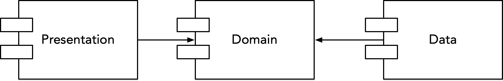
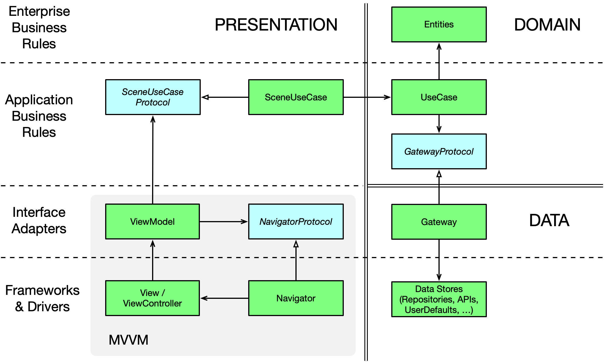
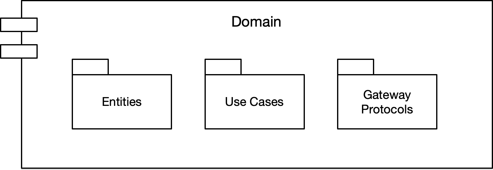
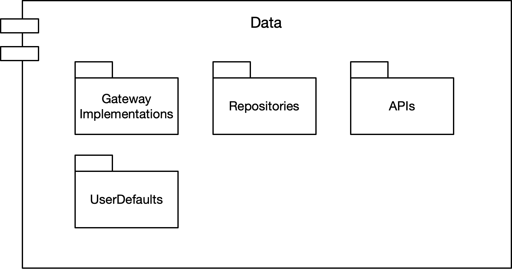
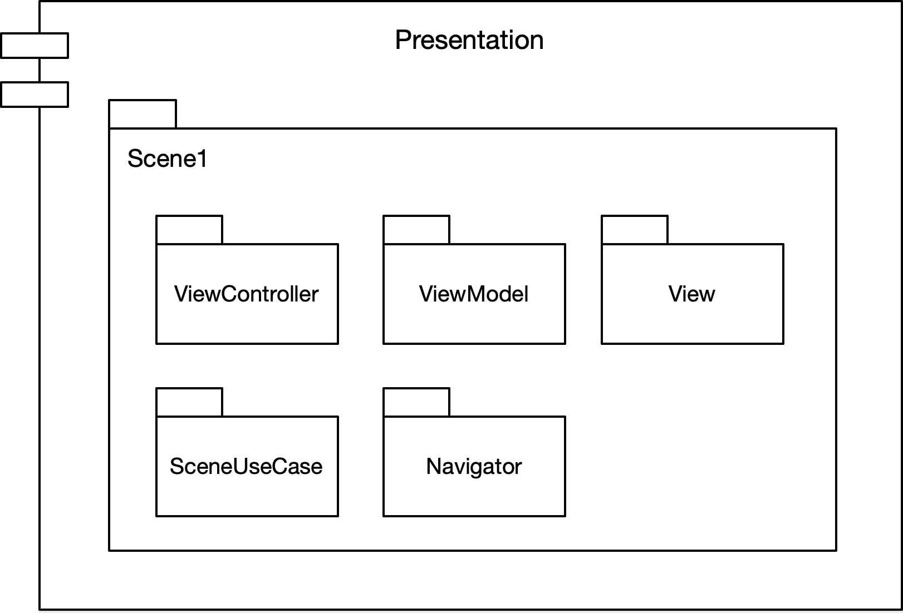

# iOS Clean Architecture (MVVM + Combine + SwiftUI/UIKit)


## High Level Overview


* **Domain Layer**: Entities + Use Cases + Gateway Protocols
* **Data Layer**: Gateway Implementations + API (Network) + Database
* **Presentation Layer**: ViewModels + Views  + Navigator + Scene Use Cases

**Dependency Direction**




## Detail Overview




### Domain Layer



#### Entities
Entities encapsulate enterprise-wide Critical Business Rules. An entity can be an object with methods, or it can be a set of data structures and functions. It doesn’t matter so long as the entities can be used by many different applications in the enterprise. - _Clean Architecture: A Craftsman's Guide to Software Structure and Design (Robert C. Martin)_

Entities are simple data structures:

```swift
struct Repo {
    var id = 0
    var name = ""
    var fullname = ""
    var urlString = ""
    var starCount = 0
    var folkCount = 0
    var avatarURLString = ""
}
```

#### Use Cases

The software in the use cases layer contains application-specific business rules. It encapsulates and implements all of the use cases of the system. These use cases orchestrate the flow of data to and from the entities, and direct those entities to use their Critical Business Rules to achieve the goals of the use case. - _Clean Architecture: A Craftsman's Guide to Software Structure and Design (Robert C. Martin)_

UseCases are protocols which do one specific thing:

```swift
protocol GettingRepos {
    var repoGateway: RepoGatewayType { get }
}

extension GettingRepos {
    func getRepos(_ dto: GetPageDto) -> Observable<PagingInfo<Repo>> {
        repoGateway.getRepos(dto)
    }
}
```

#### Data transfer object - DTO

DTO - an object that carries data between processes, it also performs data verification:

```swift
struct LoginDto: Dto {
    @Validated(.nonEmpty(message: "Please enter user name"))
    var username: String?

    @Validated(.nonEmpty(message: "Please enter password"))
    var password: String?
    
    var validatedProperties: [ValidatedProperty] {
        return [_username, _password]
    }
    
    init(username: String, password: String) {
        self.username = username
        self.password = password
    }
    
    init() { }
    
    static func validateUserName(_ username: String) -> Result<String, ValidationError> {
        LoginDto()._username.isValid(value: username)
    }
    
    static func validatePassword(_ password: String) -> Result<String, ValidationError> {
        LoginDto()._password.isValid(value: password)
    }
}

```


#### Gateway Protocols
Generally gateway is just another abstraction that will hide the actual implementation behind, similarly to the Facade Pattern. It could a Data Store (the Repository pattern), an API gateway, etc. Such as Database gateways will have methods to meet the demands of an application. However do not try to hide complex business rules behind such gateways. All queries to the database should relatively simple like CRUD operations, of course some filtering is also acceptable. - [Source](https://crosp.net/blog/software-architecture/clean-architecture-part-2-the-clean-architecture/)

```swift
protocol RepoGatewayType {
    func getRepos(_ dto: GetPageDto) -> Observable<PagingInfo<Repo>>
}
```

_Note: For simplicity we put the Gateway protocols and implementations in the same files. In fact, Gateway protocols should be at the Domain Layer and implementations at the Data Layer._

### Data Layer



Data Layer contains Gateway Implementations and one or many Data Stores. Gateways are responsible for coordinating data from different Data Stores. Data Store can be Remote or Local (for example persistent database). Data Layer depends only on the Domain Layer.

#### Gateway Implementations

```swift
struct RepoGateway: RepoGatewayType {
    func getRepos(_ dto: GetPageDto) -> Observable<PagingInfo<Repo>> {
        let input = API.GetRepoListInput(dto: dto)
        
        return API.shared.getRepoList(input)
            .map { (output) -> [Repo]? in
                return output.repos
            }
            .replaceNil(with: [])
            .map { PagingInfo(page: dto.page, items: $0) }
            .eraseToAnyPublisher()
    }
}
```

#### UserDefaults

```swift
enum AppSettings {
    @Storage(key: "didInit", defaultValue: false)
    static var didInit: Bool
}
```

#### APIs

```swift
extension API {
    func getRepoList(_ input: GetRepoListInput) -> Observable<GetRepoListOutput> {
        return request(input)
    }
    
    final class GetRepoListInput: APIInput {
        init(dto: GetPageDto) {
            let params: Parameters = [
                "q": "language:swift",
                "per_page": dto.perPage,
                "page": dto.page
            ]
            
            super.init(urlString: API.Urls.getRepoList,
                       parameters: params,
                       method: .get,
                       requireAccessToken: true)
            
            usingCache = dto.usingCache
        }
    }
    
    final class GetRepoListOutput: APIOutput {
        private(set) var repos: [Repo]?
        
        override func mapping(map: Map) {
            super.mapping(map: map)
            repos <- map["items"]
        }
    }
}
```

Map JSON Data to Domain Entities using ObjectMapper:

```swift
import ObjectMapper 

extension Repo: Mappable {
    
    init?(map: Map) {
        self.init()
    }
    
    mutating func mapping(map: Map) {
        id <- map["id"]
        name <- map["name"]
        fullname <- map["full_name"]
        urlString <- map["html_url"]
        starCount <- map["stargazers_count"]
        folkCount <- map["forks"]
        avatarURLString <- map["owner.avatar_url"]
    }
}

```

_Note: Again, for simplicity we put entities and mappings in the same files and use entities as data models for APIs. You can create data models for APIs and map to entities._

### Presentation Layer



In the current example, Presentation is implemented with the MVVM pattern and heavy use of Combine, which makes binding very easy.


#### ViewModel

* ViewModel is the main point of MVVM application. The primary responsibility of the ViewModel is to provide data to the view, so that view can put that data on the screen.
* It also allows the user to interact with data and change the data.
* The other key responsibility of a ViewModel is to encapsulate the interaction logic for a view, but it does not mean that all of the logic of the application should go into ViewModel.
* It should be able to handle the appropriate sequencing of calls to make the right thing happen based on user or any changes on the view.
* ViewModel should also manage any navigation logic like deciding when it is time to navigate to a different view.
[Source](https://www.tutorialspoint.com/mvvm/mvvm_responsibilities.htm)

ViewModel performs pure transformation of a user Input to the Output:

```swift
public protocol ViewModel {
    associatedtype Input
    associatedtype Output
    
    func transform(_ input: Input, cancelBag: CancelBag) -> Output
}
```

```swift
struct ReposViewModel {
    let navigator: ReposNavigatorType
    let useCase: ReposUseCaseType
}

// MARK: - ViewModelType
extension ReposViewModel: ViewModel {
    struct Input {
        let loadTrigger: Driver<Void>
        let reloadTrigger: Driver<Void>
        let loadMoreTrigger: Driver<Void>
        let selectRepoTrigger: Driver<IndexPath>
    }
    
    final class Output: ObservableObject {
        @Published var repos = [RepoItemViewModel]()
        @Published var isLoading = false
        @Published var isReloading = false
        @Published var isLoadingMore = false
        @Published var alert = AlertMessage()
        @Published var isEmpty = false
    }
    
    func transform(_ input: Input, cancelBag: CancelBag) -> Output {
        let output = Output()
        
        let getPageInput = GetPageInput(loadTrigger: input.loadTrigger,
                                        reloadTrigger: input.reloadTrigger,
                                        loadMoreTrigger: input.loadMoreTrigger,
                                        getItems: useCase.getRepos)
        
        let (page, error, isLoading, isReloading, isLoadingMore) = getPage(input: getPageInput).destructured

        page
            .map { $0.items.map(RepoItemViewModel.init) }
            .assign(to: \.repos, on: output)
            .store(in: cancelBag)
        
        input.selectRepoTrigger
            .handleEvents(receiveOutput: { indexPath in
                let repo = getPageInput.pageSubject.value.items[indexPath.row]
                self.navigator.toRepoDetail(repo: repo)
            })
            .sink()
            .store(in: cancelBag)
        
        error
            .receive(on: RunLoop.main)
            .map { AlertMessage(error: $0) }
            .assign(to: \.alert, on: output)
            .store(in: cancelBag)
        
        isLoading
            .assign(to: \.isLoading, on: output)
            .store(in: cancelBag)
        
        isReloading
            .assign(to: \.isReloading, on: output)
            .store(in: cancelBag)
        
        isLoadingMore
            .assign(to: \.isLoadingMore, on: output)
            .store(in: cancelBag)
        
        return output
    }
}
```

A ViewModel can be injected into a ViewController via property injection or initializer. In the current example, this is done by Assembler.

```swift
protocol ReposAssembler {
    func resolve(navigationController: UINavigationController) -> ReposViewController
    func resolve(navigationController: UINavigationController) -> RepoCollectionViewController
    func resolve(navigationController: UINavigationController) -> ReposViewModel
    func resolve(navigationController: UINavigationController) -> ReposNavigatorType
    func resolve() -> ReposUseCaseType
}

extension ReposAssembler {
    func resolve(navigationController: UINavigationController) -> ReposViewController {
        let vc = ReposViewController.instantiate()
        let vm: ReposViewModel = resolve(navigationController: navigationController)
        vc.bindViewModel(to: vm)
        return vc
    }
    
    func resolve(navigationController: UINavigationController) -> RepoCollectionViewController {
        let vc = RepoCollectionViewController.instantiate()
        let vm: ReposViewModel = resolve(navigationController: navigationController)
        vc.bindViewModel(to: vm)
        return vc
    }
    
    func resolve(navigationController: UINavigationController) -> ReposViewModel {
        return ReposViewModel(
            navigator: resolve(navigationController: navigationController),
            useCase: resolve()
        )
    }
}

extension ReposAssembler where Self: DefaultAssembler {
    func resolve(navigationController: UINavigationController) -> ReposNavigatorType {
        return ReposNavigator(assembler: self, navigationController: navigationController)
    }
    
    func resolve() -> ReposUseCaseType {
        return ReposUseCase(repoGateway: resolve())
    }
}

extension ReposAssembler where Self: PreviewAssembler {
    func resolve(navigationController: UINavigationController) -> ReposNavigatorType {
        return ReposNavigator(assembler: self, navigationController: navigationController)
    }
    
    func resolve() -> ReposUseCaseType {
        return ReposUseCase(repoGateway: resolve())
    }
}
```

ViewModels provide data and functionality to be used by views:

```swift
struct RepoItemViewModel {
    let repo: Repo
    let name: String
    let url: URL?
    
    init(repo: Repo) {
        self.repo = repo
        name = repo.name
        url = URL(string: repo.avatarURLString)
    }
}
```

#### Scene Use Case
Scene Use Case acts as an intermediary between the Presentation Layer and the Domain Layer. It includes individual use cases for each screen, which makes testing the ViewModel easier.

Scene Use Case uses the Facade pattern.

```swift
protocol ReposUseCaseType {
    func getRepos(page: Int) -> Observable<PagingInfo<Repo>>
}

struct ReposUseCase: ReposUseCaseType, GettingRepos {
    let repoGateway: RepoGatewayType
    
    func getRepos(page: Int) -> Observable<PagingInfo<Repo>> {
        let dto = GetPageDto(page: page, perPage: 10, usingCache: true)
        return getRepos(dto: dto)
    }
}
```

## Testing
### What to test?
In this architecture, we can test Use Cases, ViewModels and Entities (if they contain business logic).

#### Use Case

```swift
import XCTest

final class LoggingInTests: XCTestCase, LoggingIn {
    var authGateway: AuthGatewayType {
        return authGatewayMock
    }
    
    private var authGatewayMock = AuthGatewayMock()
    private var cancelBag: CancelBag!

    override func setUpWithError() throws {
        cancelBag = CancelBag()
    }
    
    func test_login() {
        let result = expectValue(of: self.login(dto: LoginDto(username: "username", password: "password")),
                                 equals: [ { _ in true } ])
        wait(for: [result.expectation], timeout: 1)
    }
    
    func test_login_failed() {
        authGatewayMock.loginReturnValue = .failure(TestError())
        
        let result = expectFailure(of: self.login(dto: LoginDto()))
        wait(for: [result.expectation], timeout: 1)
    }
}
```

#### ViewModel

```swift
final class ProductsViewModelTests: XCTestCase {
    private var viewModel: ProductsViewModel!
    private var navigator: ProductsNavigatorMock!
    private var useCase: ProductsUseCaseMock!
    
    private var input: ProductsViewModel.Input!
    private var output: ProductsViewModel.Output!
    private var loadTrigger = PassthroughSubject<Void, Never>()
    private var reloadTrigger = PassthroughSubject<Void, Never>()
    private var selectTrigger = PassthroughSubject<IndexPath, Never>()
    
    private var cancelBag: CancelBag!
    
    override func setUp() {
        super.setUp()
        navigator = ProductsNavigatorMock()
        useCase = ProductsUseCaseMock()
        viewModel = ProductsViewModel(navigator: navigator, useCase: useCase)
        
        input = ProductsViewModel.Input(loadTrigger: loadTrigger.eraseToAnyPublisher(),
                                        reloadTrigger: reloadTrigger.eraseToAnyPublisher(),
                                        selectTrigger: selectTrigger.eraseToAnyPublisher())
        
        cancelBag = CancelBag()
        output = viewModel.transform(input, cancelBag: cancelBag)
    }
    
    func test_loadTrigger_getProducts() {
        // act
        loadTrigger.send(())
        
        // assert
        wait {
            XCTAssert(self.useCase.getProductsCalled)
            XCTAssertEqual(self.output.products.count, 1)
        }
    }

    ...

}
```

## Project Folder and File Structure

```
- /CleanArchitecture    
    - /Domain
        - /UseCases
            - /Product
                - GettingProductList.swift
                - UpdatingProduct.swift
                - DeletingProduct.swift
                ...
            - /Login
            - /App
            - /User
            - /Repo
        - /Entities
            - Product.swift
            - User.swift
            - Repo.swift
    - /Data
        - /Gateways
            - RepoGateway.swift
            - UserGateway.swift
            - AppGateway.swift
            ...
        - /UserDefaults
            - AppSettings.swift
        - /API
            - API+Product.swift
            - API+Repo.swift
        - /CoreData
            - UserRepository.swift
    - /Scenes
        - /App
        - /Main
        - /Login
        - /UserList
        - /Products
        ...
    - /Config
        - APIUrls.swift
    	- Notifications.swift
    - /Support
        - /Extension
            - UIViewController+.swift
            - UITableView+.swift
            ...
        - Utils.swift
    - /Resources
        - /Assets.xcassets
    - AppDelegate.swift
    - Assembler.swift
    - ...

- /CleanArchitectureTests
    - /Domain
    - /Data
    - /Scenes
```

## Links
* [Clean Architecture (RxSwift + UIKit)](https://github.com/tuan188/MGCleanArchitecture)
* [Using Clean Architecture in Flutter - codeburst](https://codeburst.io/using-clean-architecture-in-flutter-d0437d0c7f87)
* [MVVM Responsibilities - Tutorialspoint](https://www.tutorialspoint.com/mvvm/mvvm_responsibilities.htm)
* [Dependency Injection in Swift - Making Tuenti - Medium](https://medium.com/makingtuenti/dependency-injection-in-swift-part-1-236fddad144a)


